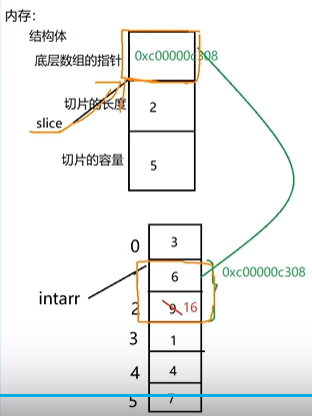

# GO学习

## 1. 安装

### 1.1 安装go

golang.org或者网络搜索golang，直接下载安装。

### 1.2 go env配置环境变量

* 配置环境变量

GOROOT - GOLANG的安装目录

GOPATH - 源码目录，自己定义

* 开启go module  
```
go env -w GO111MODULE=on
```

* 开启go代理
```
go env -w GOPROXY=https://goproxy.cn,direct
```

### 1.3 创建go工程

* 创建go module
```
go mod init hello-world    
```
只能有一个 main package 

goland是go的集成开发环境，ctrl+b跳进函数定义

### 1.4 运行go工程

```
go run main.go   
```

### 1.5 编译go工程

```
go build main.go
```

### 1.6 go语言基础

* 变量定义
```
var name string = "qiuli"

var (
	name string
	age int
	addr string
)
```
* 变量定义加赋值,:=自动推导出类型并赋值，只能在函数内部
```
name := "qiuli"
```

* 变量值交换，不用另外建一个临时变量倒了
```
a,b = b,a
```

* 变量地址输出 %p
```
fmt.Printf("num的值是：%d,num的地址是：%p",num,&num)
```

%T输出变量类型，%t 布尔bool类型， %d证书，%s字符串


* 匿名变量"_",匿名变量会被抛弃
```
func test()(int,int){
	return 1000,2000
}
a,_ := test()
_,b := test()
```

* iota 常量计数器，一组常量定义里有一个常量就加1，const每次出现的时候，iota会被置0
```
	const (
		a = iota //0
		b        //1
		c = "hehe" //hehe
		d = iota //3
	)
	const (
		e = iota //0
		f        //1
	)
	fmt.Println(a, b, c, d, e, f)    
```

* 数组,基本数据类型和数组，结构体都是值传递（拷贝了一份，并不影响本身）
```
package main

import (
	"fmt"
)

func main() {
	arr := [4]int{1, 2, 3, 4}
	update(arr)
	fmt.Println("主函数中更新之后的数组是:", arr)
}

func update(arrTemp [4]int) {
	fmt.Println("子函数中传进来的数组是:", arrTemp)
	arrTemp[1] = 8
	fmt.Println("子函数中更新后的数组是:", arrTemp)
}
```

* 切片slice，可以扩容的数组,切片，map， channel都是引用传递，地址同一个
```
package main

import (
	"fmt"
)

func main() {
	s1 := []int{1, 2, 3, 4}
	update(s1)
	fmt.Println("主函数中更新之后的切片是:", s1)
}

func update(sliceTemp []int) {
	fmt.Println("子函数中传进来的切片是:", sliceTemp)
	sliceTemp[1] = 8
	fmt.Println("子函数中更新后的切片是:", sliceTemp)
}
```


* range和for做循环
```
str := "hello world"
for i,v := range str {
	fmt.Printf("i的值是%d",i)
	fmt.Printf("v的值是%c",v)

}
```

* 函数 第一个（）内是参数，第二个（）内是函数返回值类型
```
func funcName(a,b int)(int){
	c:=a+b
	return c
}
```


* 函数 可变参数

如果还有其他参数，可变参数要放到最后，最多只能有一个可变参数。

any是interface{}，可以是任意类型 
```
package main

import (
	"fmt"
	"strconv"
)

func main() {
	getSum(1, "2", 3, "4", 5, 6)
}

func getSum(nums ...any) {
	sum := 0
	num := 0
	for i := 0; i < len(nums); i++ {
		switch nums[i].(type) {                        //变量.(type)可以获取变量类型
		case string:
			num, _ = strconv.Atoi(nums[i].(string))    //字符串转int
		case int:
			num = nums[i].(int)                        //将any类型转为int类型
		}
		sum += num
	}
	fmt.Printf("Sum is: %d", sum)
}
```

* 递归函数 需要一个出口，逐渐向出口靠近
```
ackage main

import "fmt"

func main() {
	sum := getSum(5)
	fmt.Println(sum)
}

func getSum(n int) int {
	if n == 1 {              //出口
		return 1
	}
	return getSum(n-1) + n
}
```

* defer函数 延迟执行

其余函数都执行完再执行，多条defer，会按照从后往前的顺序执行，常用于关闭操作
文件.open()
defer 文件.close()
读或写操作

```
package main

import "fmt"

func main() {
	myPrint(1)
	defer myPrint(2)
	myPrint(3)
	defer myPrint(4)
	myPrint(5)
	defer myPrint(6)
}

func myPrint(i int) {
	fmt.Println(i)
}
```

* 函数本质

函数名是变量，指向内存地址，可以赋值，可以当参数

匿名函数可以自己调用自己

```
package main

import "fmt"

func main() {
	func(a, b int) {     //函数内存中地址
		fmt.Println(a, b)
	}(2, 3)              //()直接调用
}
```
相当于

```
package main

import "fmt"

func main() {
	f := func(a, b int) {
		fmt.Println(a, b)
	}
	f(2, 3)
}
```

* 公共函数变量首字母大写

在go中，函数和变量首字母大写才能被其他模块使用

公有函数的首字母以大写开头，私有函数的首字母以小写开头。

* 错误捕获处理 defer + recover
```
package main

import "fmt"

func main() {
	e := test()
	fmt.Println("e的值是", e)
	fmt.Println("看看能否输出")
}

func test() int {
	defer func() {
		err := recover()
		if err != nil {
			fmt.Println("错误是", err)
		}
	}()
	a := 10
	b := 0
	return a / b
}
```

自定义错误
```
package main

import (
	"errors"
	"fmt"
)

func main() {
	err := test()
	if err != nil {
		fmt.Println("错误是", err)
		panic(err)
	}
	fmt.Println("看看能否输出")
}

func test() error {
	a := 10
	b := 0
	if b == 0 {
		return errors.New("除数不能为0撒！")
	} else {
		fmt.Println("结果是", a/b)
	}
	return nil
}
```

* 切片
值类型：复制一份，并不改变原有值
引用类型： 用同一份，会改变原有值

切片是引用数据类型，改动切片，地址中的值会改变
```
package main

import (
	"fmt"
)

func main() {
	var arrayint [6]int = [6]int{0, 1, 2, 3, 4, 5}
	slice := arrayint[1:3]
	fmt.Println("slice:", slice)
	slice[1] = 8
	fmt.Println("arrayint:", arrayint)
}

结果
slice: [1 2]
arrayint: [0 1 8 3 4 5]
```
切片在内存中以结构体的方式储存，3个成员，首地址，切片长度和切片容量


切片定义方式

切片可以引用某个已经创建好的数组，切片定义好之后必须引用数组或用make开辟了内存地址，才能使用
切片索引不能越界，

用make函数定义切片，make实际在底层创建了一个不可见的数组
```
package main

import (
	"fmt"
)

func main() {
	slice := make([]int, 5, 8)
	fmt.Println("slice:", slice)
	fmt.Println("slice的长度", len(slice))
	fmt.Println("slice的容量", cap(slice))
}

结果
slice: [0 0 0 0 0]
slice的长度 5
slice的容量 8

```

切片的遍历,切片还可以再切
```
package main

import "fmt"

func main() {
	slice := make([]int, 5, 8)
	for i := 0; i < len(slice); i++ {
		slice[i] = i * 10
	}
	for i, v := range slice {
		fmt.Printf("slice[%v]=%v \n", i, v)
	}
	slice1 := slice[1:3]
	fmt.Println("slice1:", slice1)
}

结果
slice[0]=0
slice[1]=10
slice[2]=20
slice[3]=30
slice[4]=40
slice1: [10 20]
```

切片的引用数组时的简写方式
```
var slice = arr[0:end]  =>    slice := arr[:end]
var slice = arr[start:len(arr)]  =>    slice := arr[start:]
var slice = arr[0:len(arr)]  =>    slice := arr[:]
```

append()函数给slice扩容，会产生一块新地址，不会改老地址里的值
```
package main

import "fmt"

func main() {
	arr := [6]int{0, 1, 2, 3, 4, 5}
	slice := arr[3:]
	slice1 := append(slice, 66, 77, 88, 99, 00, 11, 22)
	slice1[0] = 33
	fmt.Println("slice1:", slice1)
	fmt.Println("slice:", slice)
	slice = append(slice, 66, 77, 88, 99, 00, 11, 22)
	fmt.Println("slice:", slice)
	fmt.Printf("slice的地址是：%p\n", &slice)
	fmt.Printf("slice1的地址是：%p", &slice1)
}

结果
slice1: [33 4 5 66 77 88 99 0 11 22]
slice: [3 4 5]
slice: [3 4 5 66 77 88 99 0 11 22]
slice的地址是：0xc000008078
slice1的地址是：0xc000008090
```

用...把切片打散成一个个元素,copy函数可以拷贝slice到另一个slice
必须用slice1...把slice1打散成6，7，8，否则报错，append只接受n个基本类型的参数。
```
package main

import "fmt"

func main() {
	arr := [6]int{0, 1, 2, 3, 4, 5}
	slice := arr[:5]
	slice1 := []int{6, 7, 8}
	slice = append(slice, slice1...)
	fmt.Println("slice:", slice)
	slice2 := make([]int, 20)
	copy(slice2, slice)
	fmt.Println("slice2:", slice2)
}
结果
slice: [0 1 2 3 4 6 7 8]
slice2: [0 1 2 3 4 6 7 8 0 0 0 0 0 0 0 0 0 0 0 0]
```

## 2. go web 框架 - gin

文档 =》 https://gin-gonic.com/zh-cn/docs/

go 1.18版本之后，引入多模块工作区, 一个工作区里可以包含各个模块

进入hello目录，go mod init poc.com/hello，会初始化hello模块依赖

go work init ./hello  //把本地仓库hello加入到工作区并设为主模块
go work use ./example //把本地另一个仓库加入到工作区，非主模块

如果go get有问题，就用下面两个命令
```
go env -w GOPROXY="https://goproxy.io"
go env -w GO111MODULE="on"
```

### 2.1 下载并安装Gin
```
go get -u github.com/gin-gonic/gin
```
会安装在gopath/pkg/mod下，看gopath用go env命令。

### 2.2 引入Gin框架
```
import "github.com/gin-gonic/gin"
```

### 2.3 Gin框架hello world实例

```
package main

import "github.com/gin-gonic/gin"

func sayHello(c *gin.Context) {
	c.JSON(200, gin.H{
		"message": "hello golang!",
	})
}

func main() {
	r := gin.Default() //返回默认的路由引擎

	r.GET("/hello", sayHello) //GET请求执行sayHello函数

	r.Run(":9090") //启动服务
}
```
go build之后运行可执行文件，浏览器访问http://localhost:9090/hello


### 2.4 Gin框架引入前端dist目录实例

将dist目录下的static目录，index.html...拷贝到go project根目录里。在go 项目中新建templates文件夹，将index.html, favicon.ico放入。然后编码如下，在go build，之后运行生成的可执行文件。
```
package main

import (
	"net/http"

	"github.com/gin-gonic/gin"
)

func main() {
	r := gin.Default()            //返回默认的路由引擎
	r.Static("/static", "static") //静态文件去哪找
	r.LoadHTMLGlob("templates/*") //去哪找html模板文件
	r.GET("/", func(c *gin.Context) {
		c.HTML(http.StatusOK, "index.html", nil)
	}) //GET请求执行匿名函数返回index.html

	r.Run(":9090") //启动服务
}
```
